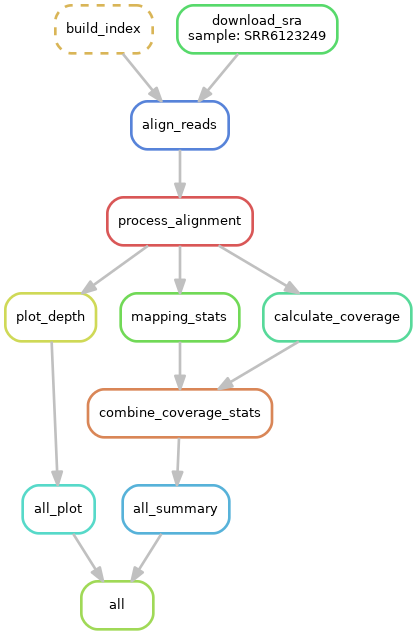

# hisss: HIgh-throughput Shotgun Sequence Searcher
A Snakemake workflow to download/align reads to targets and produce useful outputs. With hiss, you can:

 0. Download reads for all samples from a study archived in NCBI's [sequence read archive](https://www.ncbi.nlm.nih.gov/sra) (optional). If you'd like to ONLY do this, check out [grabseqs](https://github.com/louiejtaylor/grabseqs), an easy-to-use utility that spun off from this project.
 1. Stringently align .fastq files to one or more target sequences using bowtie-2
 2. Generate coverage maps for each positive sample
 3. Generate standardized summary tables with information on depth and breadth of coverage for each positive sample.

## Installing

Getting it up and running is hopefully simple:

    git clone https://github.com/louiejtaylor/hisss
    cd hisss
    
We use conda to handle dependencies; you can install miniconda from [here](https://conda.io/miniconda.html). Make a new conda enviroment, then install dependencies from `requirements.txt` like so:
    
    conda create -n hisss
    source activate hisss
    conda install -c bioconda -c conda-forge -c louiejtaylor --file requirements.txt 
    
Conda is great for managing dependencies and environments without requiring any admin privileges.

## Configuration

Hisss can run on both local and remote fastqs that are either paired or unpaired. The options in `config_template.yml` should be self-explanatory--just replace the placeholders with the relevant paths to your samples and alignment targets. 

The final step in setting up your config is to add your samples. We include two utilites to simplify adding samples to your config file depending on where your data are located: `list_SRA.py` and `list_samples.py`.

### SRA or MG-RAST data

If you're using data from [the SRA](https://www.ncbi.nlm.nih.gov/sra), grabbing all the samples from a study is as simple as passing the project identifier (SRP#) to `list_SRA.py` like so:

    python ./scripts/list_SRA.py SRP####### >> my_config.yml

This command will append nicely-formatted sample names to `my_config.yml`, along with some metadata of questionable utility. It also saves the full SRA metadata file as a .csv (so we recommend running this in your project directory). You also don't need to know whether the reads are paired- or single-end beforehand--as long as the information is in the SRA metadata it'll be included.

A similar script is available for MG-RAST data, which can be used like so:

    python ./scripts/list_MGRAST.py mgp###### >> my_config.yml    

### Local data

If you're running on local samples, use `list_samples.py`. Let's say your fastqs are paired, located in `/project/fastq/`, and are named like `Sample_[sample_name]_R[pair].fastq`:

    python ./scripts/list_samples.py -pattern "Sample_{sample}_R{rp}.fastq" /project/fastq/ >> my_config.yml

## Running

To run, simply execute the following in the hisss root dir. The `-p` flag will print out the shell commands that will be executed. If you'd like to do a dry run (see the commands without running them), pass `-np` instead of `-p`.

    snakemake -p --configfile [path/to/my_config.yml] all

If you're running on SRA data, we recommend using `--restart-times` since we've encountered issues with downloads randomly failing:

    snakemake -p --restart-times 5 --configfile [path/to/my_config.yml] all
    
And if you'd just like to use hisss only to grab the data from SRA, pass the `--notemp` flag and specify `download_only` as the target rule:

    snakemake -p --restart-times 5 --notemp --configfile [path/to/my_config.yml] download_only

There are many more useful options that you could pass to snakemake that are beyond the scope of this tutorial. Read more about them [here](http://snakemake.readthedocs.io/en/stable/executable.html)! 

When you're done, to leave the conda environment:

    source deactivate

## Troubleshooting

To run the dummy data (which should complete very quickly):

    snakemake -p --configfile test_data/test_config.yml all
    
If you want to run the dummy data again after tinkering with the Snakefile or rules, you can clean up the test output like so:

    cd test_data
    bash clean_test.sh

Feel free to [open an issue](https://github.com/louiejtaylor/hisss/issues) or tweet [@Louviridae](https://twitter.com/Louviridae) or [@A2_Insanity](https://twitter.com/A2_Insanity) if you have problems. Good luck!

## Current workflow 

(generated by [graphviz](https://www.graphviz.org/doc/info/lang.html))

